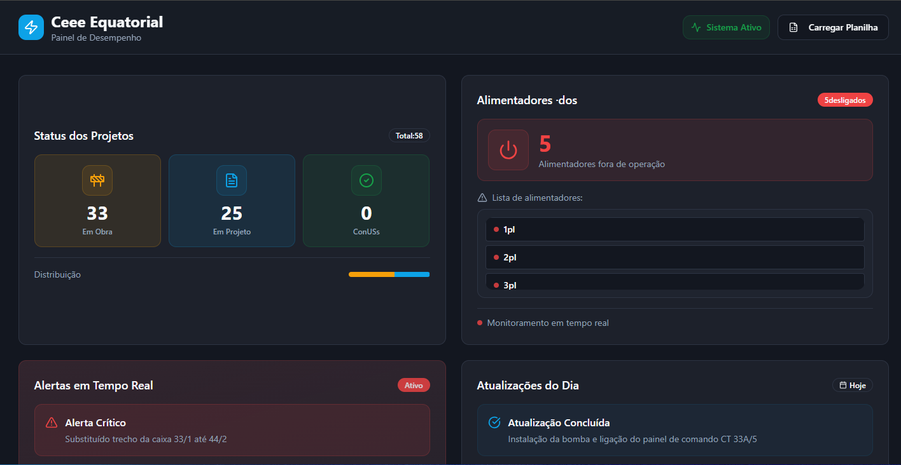
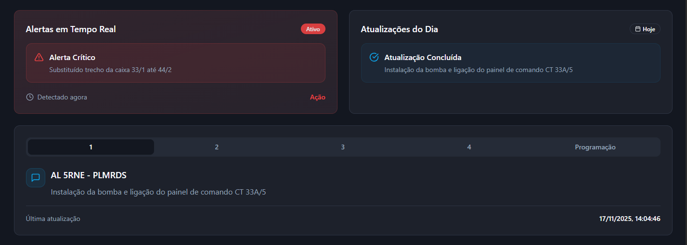
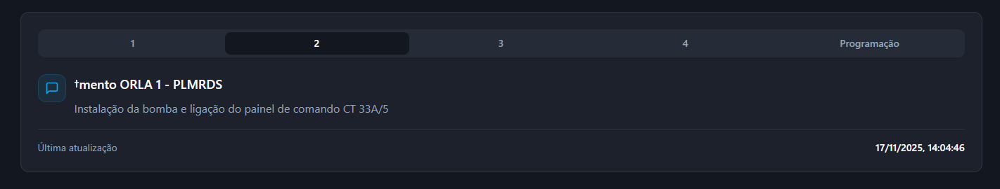
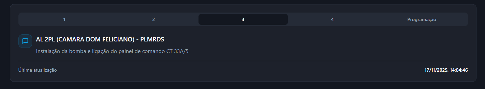
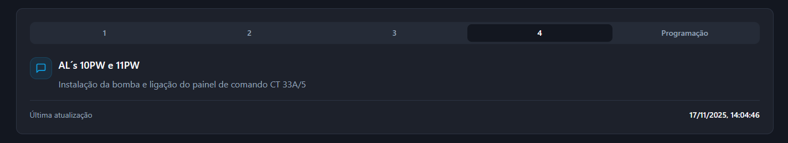
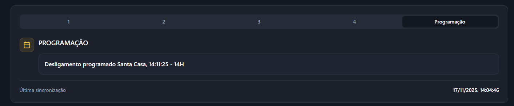

📊 CEEE Equatorial – Dashboard de Performance da Rede Subterrânea
 

>Este projeto é um Dashboard Interativo de Performance desenvolvido para apoiar as operações da Rede Subterrânea da CEEE Equatorial, facilitando o acompanhamento de indicadores críticos e otimizando atividades rotineiras de campo e de supervisão.

> O sistema foi projetado para oferecer uma visualização clara, moderna e dinâmica do status operacional da rede, permitindo que equipes técnicas e de gestão tomem decisões mais rápidas e eficientes.

<tr>
📊 Como o Dashboard Funciona

Este dashboard foi desenvolvido para leitura e interpretação automática de dados a partir de um arquivo Excel.
Ao carregar a planilha, o sistema identifica os campos necessários e atualiza automaticamente todos os indicadores, cards, listas, alertas e gráficos conforme o padrão estabelecido no projeto.

O fluxo de uso é simples:

Clique em Carregar Planilha.
 

Selecione o arquivo Excel contendo os dados atualizados.

O dashboard processa a planilha e exibe todas as informações formatadas automaticamente.

Não é necessário instalar nada adicional, nem configurar manualmente os campos — basta importar o Excel e o sistema ajusta tudo em tempo real.
 
<tr>

Imagens do Projeto em funcionamento: 
 

🎯 Objetivo do Projeto

O principal objetivo deste dashboard é apoiar a Rede Subterrânea em suas atividades diárias, proporcionando:
° Monitoramento visual de status e performance da rede
° Agilidade no acompanhamento de atividades operacionais
° Facilidade na identificação de pendências, gargalos e ocorrências
° Centralização de dados importantes em um painel único
° Suporte à tomada de decisão com base em dados atualizados
° Esse dashboard foi idealizado para simplificar processos internos, reduzir tempo de análise e melhorar a eficiência das operações da rede subterrânea.

 

> Área de lembrentes essenciais;

  
  ## Projeto Responsivo 📱 

  
   
  
   
  
   
  
   
 

## Criador do Projeto 🤝

<table>
  <tr>
    <td align="center">
      <a href="https://github.com/jv1903">
         
        
          <b style="font-size: 10px;"João Vitor</b>
        
      </a>
    </td>
    
</table>
