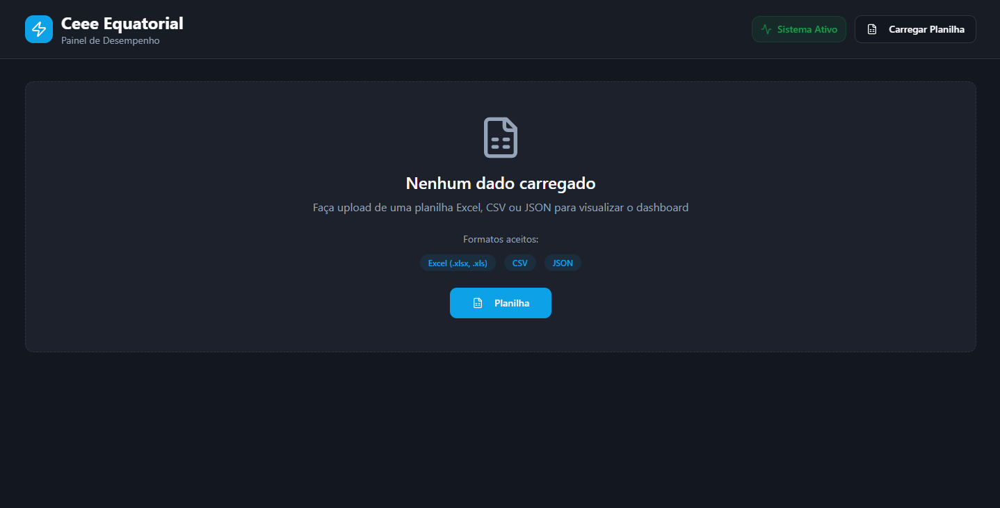

# Dashboard-RDS-conculuido

  
  
  
  
 

> Site desenvolvido como tarefa do técnico, simulando um Site de Nasa, Demonstrando Informoações sobre o aquecimento global, Aumento do nível do mar, Enchentes no RS e etc.
Site criado em 2023 - Ganhando prêmio de Melhor site, decidido pelo voto popular, tendo em mente, evoluir o site para mostra de 2024, aperfeiçoando todas melhorias desejadas.

## Ajustes e melhorias 2023 💻

O projeto está Finalizado, ficou sim pedente algumas correções que gostariamos de corrigir, mas está além de nosso conhecimento, que até o então, está otimo 

- [X] Tornar o Site responsivo para celulares
- [X] Ajustar o link do topico, para que ele redirecionar para o centro do site 

## Ajustes e melhorias 2024 💻

O projeto está Finalizado, ficou sim pedente algumas correções que gostariamos de corrigir, mas está além de nosso conhecimento, que até o então, está otimo 

- [✔️] Tornar o Site 100% responsivo para celulares
- [✔️] Ajustar o link do topico, para que ele redirecionar para o centro do site
- [✔️] Site com  novas alterações, trazendo uma nova experiência

 

  ## Site Responsivo 

  
  
  
  
 

> Agradecemos sinceramente pela sua atenção e por ter visitado nosso site. 

 

## Criadores do Projeto 🤝

<table>
  <tr>
    <td align="center">
      <a href="https://github.com/analuizamoreira">
         
        
          <b style="font-size: 13px;">Ana luiza</b>
        
      </a>
    </td>
    <td align="center">
      <a href="https://github.com/jv1903">
         
        
          <b style="font-size: 10px;"João Vitor</b>
        
      </a>
    </td>
    <td align="center">
      <a href="https://github.com/pedrolealp7">
         
        
          <b style="font-size: 13px;">Pedro Leal</b>
        
      </a>
    </td>
  </tr>
</table>
